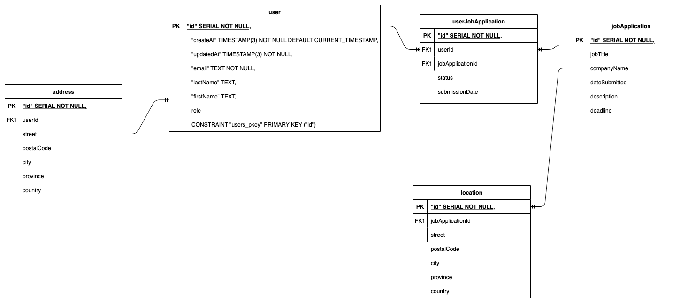

# JoTrack Backend

## Database Design



## Installation

1. Install dependencies.

   ```shell
   npm i
   ```

2. Make copy of `.env.template` file.

   ```shell
   cp .env.template .env
   ```

3. Populate fields in `.env` file.

   ```makefile
   # ...
   # jwt
   JWT_SECRET="your_jwt_secret" # change
   ```

## Running

1. Instantiate a PostgreSQL instance and apply the Prisma migration to the database.

   ```shell
   npm run db:dev:restart
   ```

2. Start the application.

   ```shell
   npm run start:dev
   ```

## Troubleshooting

### Restarting

1. Stop the application.
2. Restart database and re-apply migration.

   ```shell
   npm run db:dev:restart
   ```

3. Restart the application.

### Visualization

1. View data in a tabular format.

   ```shell
   npx prisma studio
   ```

2. Navigate to <http://localhost:5555/>.

## API Endpoints

### Auth - `/api/auth`

| Endpoint  | Method | Description     | Role Access |
| --------- | ------ | --------------- | ----------- |
| `/signup` | `POST` | Register a user | Visitor     |
| `/login`  | `POST` | Log in a user   | Visitor     |

### Users - `/api/users`

| Endpoint       | Method   | Description           | Role Access |
| -------------- | -------- | --------------------- | ----------- | --- |
| N/A            | `GET`    | Retrieve users        | Visitor     |
| N/A            | `POST`   | Create a user         | Admin       |
| `/{{userId}}`  | `PUT`    | Update a user         | Admin       |
| `/{{userId}}`  | `DELETE` | Remove a user         | Admin       |
| `/{{userId}}`  | `GET`    | Retrieve a user       | Visitor     |
| `/jobs-applied | `GET`    | Retrieve applied jobs | User        | :   |

### Jobs - `/api/jobs`

| Endpoint     | Method   | Description     | Role Access |
| ------------ | -------- | --------------- | ----------- |
| N/A          | `GET`    | Retrieve jobs   | Visitor     |
| N/A          | `POST`   | Create a job    | Admin       |
| `/{{jobId}}` | `PUT`    | Update a job    | Admin       |
| `/{{jobId}}` | `DELETE` | Remove a user   | Admin       |
| `/{{jobId}}` | `GET`    | Retrieve a job  | Visitor     |
| `/apply`     | `POST`   | Apply for a job | User        |
