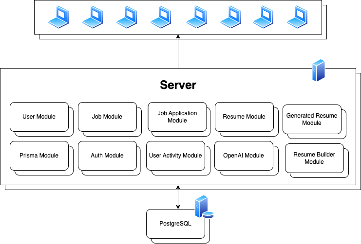
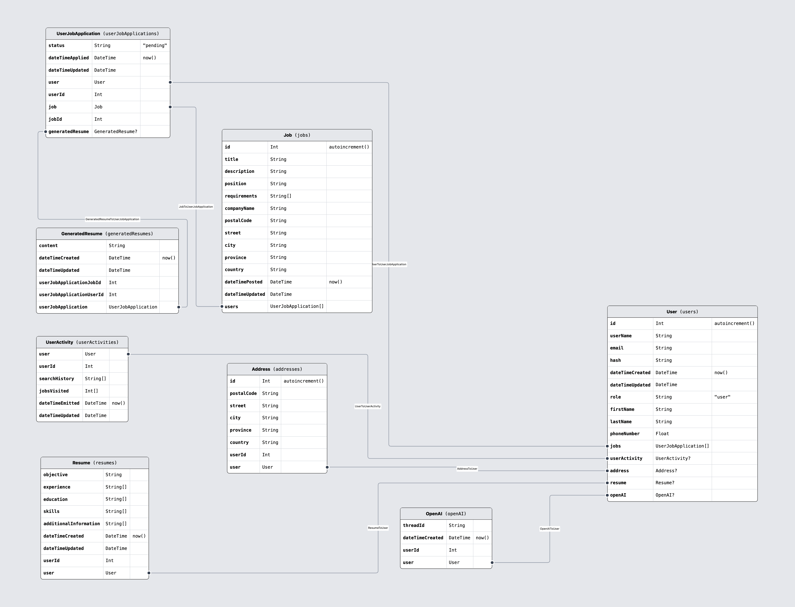

# JoTrack Backend

## Overview

A job tracking application that lets users utilize AI to build newly-generated resume based off of their uploaded master resume.

## Architecture



## Database Design



## Resume Building Usage

1. This application parses resume in a predefined structure.
2. The PDF format can be obtained under `./docs/template/jotrack-resume.pdf`.
3. Edit the master resume template as you like or use the template to be uploaded as PDF file to the program.
4. Once uploaded, you are allowed to apply for jobs.
5. Applying for jobs triggers `AI Resume Builder` to make a newly-created resume based on your master-resume tailored to the job description.
6. These `GeneratedResume` objects are accessed at `http://localhost:8000/api/generated-resumes`

## Note

> This project is a part of a larger project called [JoTrack](https://github.com/jayden-n/jotrack) where I am the backend developer, relational database architect and, RESTful API designer.

## Installation

1. Install dependencies.

   ```shell
   npm i
   ```

2. Make copy of `.env.template` file.

   ```shell
   cp .env.template .env
   ```

3. Populate fields in `.env` file.

   ```makefile
   # ...
   # jwt
   JWT_SECRET=your_jwt_secret # change (remove once changed)
   # open ai
   OPEN_AI_API_KEY=your_open_ai_api_key # change (remove once changed)
   ```

## Running

1. Instantiate a PostgreSQL instance and apply the Prisma migration to the database.

   ```shell
   npm run db:dev:restart
   ```

2. Start the application.

   ```shell
   npm run start:dev
   ```

3. Navigate to <http://localhost:8000/api/>.

## Troubleshooting

### Restarting

1. Stop the application.
2. Rebuild the application.
   ```shell
   npm run build
   ```
3. Restart database and re-apply migration.

   ```shell
   npm run db:dev:restart
   ```

4. Restart the application.

   ```shell
   npm run start:dev
   ```

### Visualization

1. View data in a tabular format.

   ```shell
   npx prisma studio
   ```

2. Navigate to <http://localhost:5555/>.

### Seeding

1. Seed 10 jobs and 10 users into the database

   ```shell
   npm run db:dev:seed
   ```

## API Endpoints

### Legends

- `V` - Visitor
- `U` - User
- `A` - Admin

<hr/>

### Auth - `/api/auth`

| Endpoint  | Method | Description     | Role Access |
| --------- | ------ | --------------- | ----------- |
| `/signup` | POST   | Register a user | `V`         |
| `/login`  | POST   | Log in a user   | `V`         |

### Users - `/api/users`

| Endpoint           | Method | Description                      | Role Access   |
| ------------------ | ------ | -------------------------------- | ------------- |
| N/A                | GET    | Retrieve users                   | `V`, `U`, `A` |
| `get-profile`      | GET    | Retrieve own profile information | `U`, `A`      |
| `/change-password` | PUT    | Change password                  | `U`, `A`      |
| `/update-profile`  | PUT    | Update profile information       | `U`, `A`      |
| `/{{userId}}`      | DELETE | Remove a user                    | `A`           |
| `/{{userId}}`      | GET    | Retrieve a user                  | `V`, `U`, `A` |

### Jobs - `/api/jobs`

| Endpoint                           | Method | Description                      | Role Access   |
| ---------------------------------- | ------ | -------------------------------- | ------------- |
| `?filter=dateTime&title={{title}}` | GET    | Retrieve jobs                    | `V`, `U`, `A` |
| `/event/?title={{title}}`          | GET    | Retrieve jobs and emit an event  | `U`           |
| N/A                                | POST   | Create a job                     | `A`           |
| `/{{jobId}}`                       | PUT    | Update a job                     | `A`           |
| `/{{jobId}}`                       | DELETE | Remove a job                     | `A`           |
| `/{{jobId}}`                       | GET    | Retrieve a job                   | `V`, `U`, `A` |
| `/event/{{jobId}}`                 | GET    | Retrieve a job and emit an event | `U`           |

### Job Applications - `/api/job-applications`

| Endpoint        | Method | Description                   | Role Access   |
| --------------- | ------ | ----------------------------- | ------------- |
| N/A             | GET    | Retrieve job applications     | `V`, `U`, `A` |
| `/applications` | GET    | Retrieve own job applications | `U`           |
| `/apply`        | POST   | Apply for a job               | `U`           |
| `/accept`       | PUT    | Accept user job application   | `A`           |
| `/reject`       | PUT    | Reject user job application   | `A`           |

### User Activities - `/api/user-activities`

| Endpoint      | Method | Description              | Role Access |
| ------------- | ------ | ------------------------ | ----------- |
| `/{{userId}}` | GET    | Retrieve user activities | `A`         |

### Resume - `/api/resumes`

| Endpoint | Method | Description         | Role Access |
| -------- | ------ | ------------------- | ----------- |
| N/A      | GET    | Retrieve own resume | `U`         |
| N/A      | POST   | Upload a resume     | `U`         |
| N/A      | PUT    | ReUpload a resume   | `U`         |

### Generated Resume - `/api/generated-resumes`

| Endpoint | Method | Description                | Role Access   |
| -------- | ------ | -------------------------- | ------------- |
| N/A      | GET    | Retrieve generated resumes | `V`, `U`, `A` |
